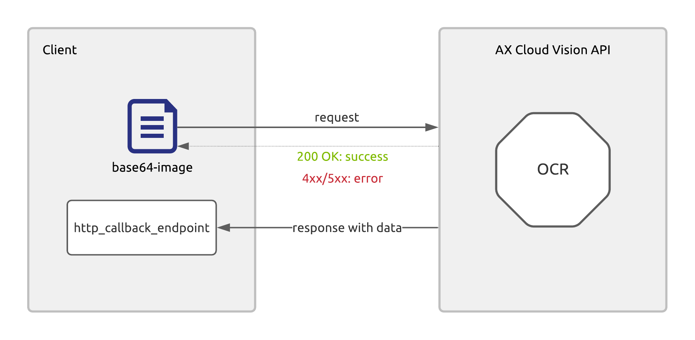

# Optical Character Recognition (OCR)

Tính năng nhận diện vùng ảnh có chứa ký tự và trích xuất nội dung. Nhận đầu vào là file cần nhận diện, trả về kết quả là danh sách toạ độ vùng chứa ký tự trên file và chuỗi ký tự của vùng ảnh đó.

Hiện tính năng OCR hỗ trợ tốt với 2 kiểu ký tự:

* Chữ in
* Chữ viết tay (tiếng Việt).

Định dạng file đầu vào:

* Images (.jpg, .png, ...)
* PDF

## Hướng dẫn

### Mô tả chung

Client gửi yêu cầu tới **AX Cloud Vision API** qua `Async HTTP request` và **AX Cloud Vision** sẽ kết quả trả về thông qua `http_callback_endpoint` mà phía client cung cấp.



* Client gửi request tới **AX Cloud Vision API**. **AX** trả về thông báo nhận yêu cầu thành công hoặc không thành công (trong trường hợp có lỗi nào đó xảy ra).
* Client nhận kết quả nhận dạng OCR thông qua `http_callback_endpoint` ngay khi AX Cloud Vision hoàn tất quá trình xử lý.

> Trường hợp gửi không thành công, client có thể dựa trên `http status code` cho AX trả về để cài đặt cơ chế retry. 

### HTTP callback

**AX Cloud Vision** sẽ chủ động trả về kết quả cho phía client ngay sau khi xử lý xong quá trình nhận dạng thông qua *callback endpoint* mà phía client cung cấp.

HTTP callback cần đảm bảo một số yêu cầu:

* Endpoint có dạng HTTP URL. Ví dụ: *http://example.com/callback/ocr*
* Protocol: `HTTP/HTTPS`
* Method: `POST`
* Header:
    - (**Required**) Content-Type: `application/json`
    - (*Optional*) Authorization: Bearer `<token>`
* Payload: chứa kết quả nhận dạng theo cấu trúc JSON

Ví dụ:
```json
{
    "fileId": <the_identity_of_the_file>,
    <ocr_outputs>
}
```

> Hiện tại, AX Cloud Vision chưa hỗ trợ phía client tự chủ động đăng ký hàm callback, do đó client cần tự xây dựng và cung cấp endpoint (kèm `<token>` để xác thực nếu có) của HTTP callback với Cyber Eye để nhận được kết quả trả về.

### Request

Mỗi request tương ứng với 1 ảnh đầu vào cần xử lý.

* HTTP URL: `http://cloud-dev.ocr.vn/api/processTaxInvoice`
* HTTP method: `POST`
* HTTP header:
    - (**Required**) _Content-Type_: `application/json`
    - (**Required**) _x-functions-key_: `<API Key>`
* HTTP payload:
    - **fileId**: là identity của file, mỗi file có một id duy nhất để phân biệt với nhau, id này sẽ được gắn kèm kết quả trả về sau khi OCR để file client có thể ánh xạ đúng.
    - **fileUrl**: là đường dẫn có thể download được của file cần nhận dạng.

#### Ví dụ

Payload chứa trong `request.json`

```json
{
    "fileId": <the_identity_of_the_file>,
    "fileUrl": <link_to_the_downloadable_file>
}
```

curl
```cmd
curl -X POST \
-H "Content-Type: application/json;" \
-H "x-function-key: <API-key>" \
-d @request.json \
"http://cloud-dev.ocr.vn/api/processTaxInvoice"
```

### Response

* HTTP status code:
    - `200 OK` nếu gửi yêu cầu thành công.
    - Mã lỗi khác kèm mô tả lỗi nếu gửi yêu cầu không thành công.

> AX Cloud Vision sẽ chỉ đối soát với những yêu cầu được gửi thành công. 